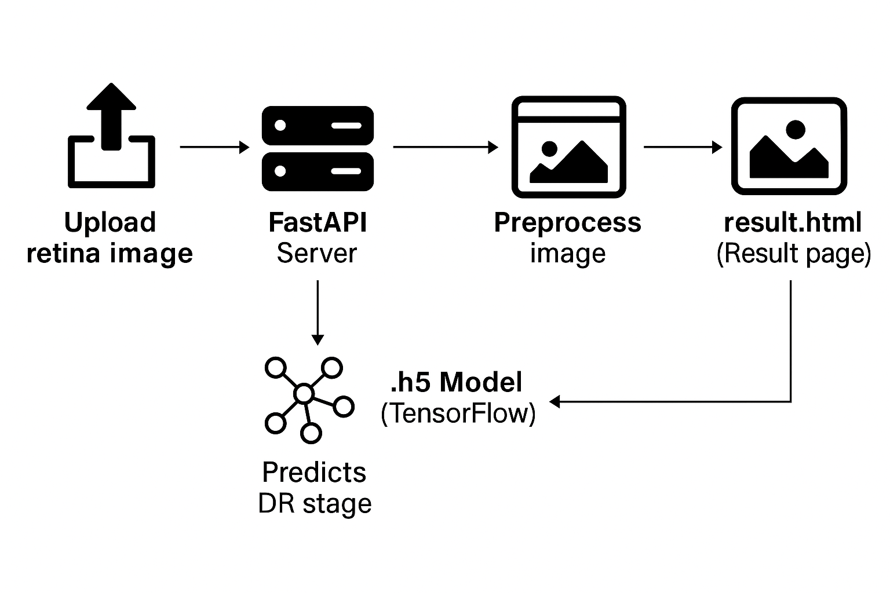
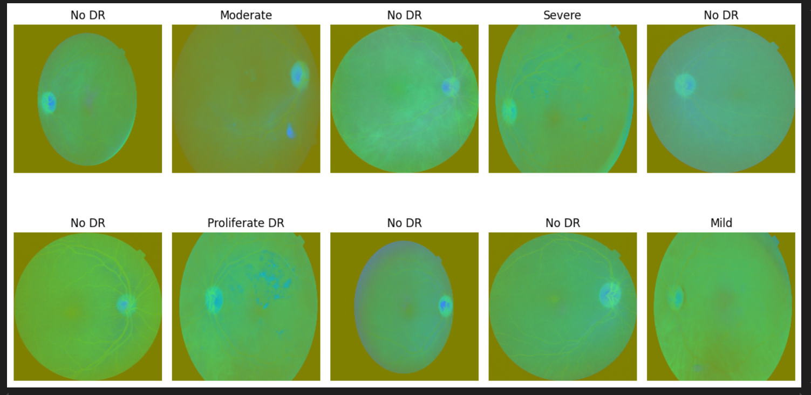
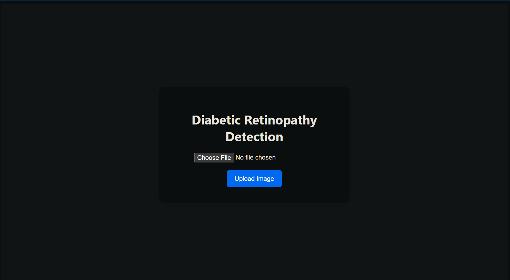
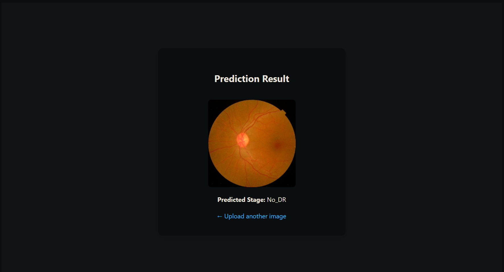

# 🧠 Diabetic Retinopathy Detection using Deep Learning (FastAPI Web App)

This is a complete end-to-end **deep learning web application** to detect **Diabetic Retinopathy** stages from retina images. It uses a trained **ResNet50** model, a clean **FastAPI backend**, and an HTML/CSS frontend. The project is easy to use, fully functional, and ready to deploy.

> 🔬 **Diabetic Retinopathy (DR)** is a diabetes complication that affects eyes and can cause blindness if not diagnosed early.

---

## 📌 Project Highlights

- ✅ Upload retina image through browser
- ✅ Predicts DR stage using `.h5` trained deep learning model
- ✅ Clean and modern web interface (HTML + CSS)
- ✅ Model built with **TensorFlow + ResNet50**
- ✅ App built using **FastAPI**
- ✅ Fully documented & organized project structure

---

## 🧠 DR Stages Detected

The model classifies input retina images into the following 5 classes:

| Class Label | Stage Name         |
|-------------|--------------------|
| 0           | No_DR              |
| 1           | Mild               |
| 2           | Moderate           |
| 3           | Severe             |
| 4           | Proliferate_DR     |

---

## 📁 Project Structure
DIABATIC_RETENOPHLYA_DETECTION/
├── DR_model.h5
├──DATASET_DIABATIC_RETENOPHLYA(dataset)/
│   └── colored_images(all images in label folder)
│   └── preprocessed_image_dir
│   └── train.csv
├──images/
│   └── uplode_page.png
│   └── flowchart.png
│   └── prediction_page.png
├── main.py
├── train.py
├── best_model.h5
├── DR_resnet50.h5
├── requirement.txt
├── static/
│   └── style.css
├── templates/
│   └── index.html
│   └── result.html
└── test_images/
    └── {test image'...}


---

## 🖼️ Screenshots

### 🔹 flow-chart


### 🔹 After Pre-processing Images


### 🔹 Upload Page


### 🔹 Result Page



---

## 🧪 Model Summary

| Component     | Details                          |
|---------------|----------------------------------|
| Architecture  | ResNet50 + custom dense layers   |
| Input Shape   | 224 x 224 x 3                    |
| Optimizer     | Adam                             |
| Loss Function | Sparse Categorical Crossentropy  |
| Accuracy      | ✅ 99% train, ✅ ~77% validation, ✅ ~71% test |

---

## 🧰 Tech Stack

- 🧠 Deep Learning – TensorFlow, Keras
- 🖼️ Image Processing – OpenCV, NumPy
- 🌐 Backend – FastAPI
- 🎨 Frontend – HTML, Jinja2, CSS
- 🐍 Language – Python 3.11

---

## 🚀 How to Run the Project

### 🔧 1. Clone the Repository

```bash
git clone https://github.com/Bkp108/Diabetic-Retinopathy-Detection.git
cd Diabetic-Retinopathy-Detection
```

### 💻 2. Create Virtual Environment

```bash
python -m venv venv
.\venv\Scripts\activate      # Windows
```

### 📦 3. Install Requirements

```bash
pip install -r requirements.txt
```

### 🏁 4. Start the FastAPI App

```bash
uvicorn main:app --reload
```

### Open your browser and go to:

http://127.0.0.1:8000
